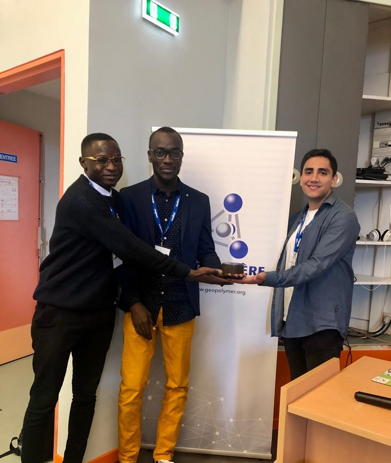
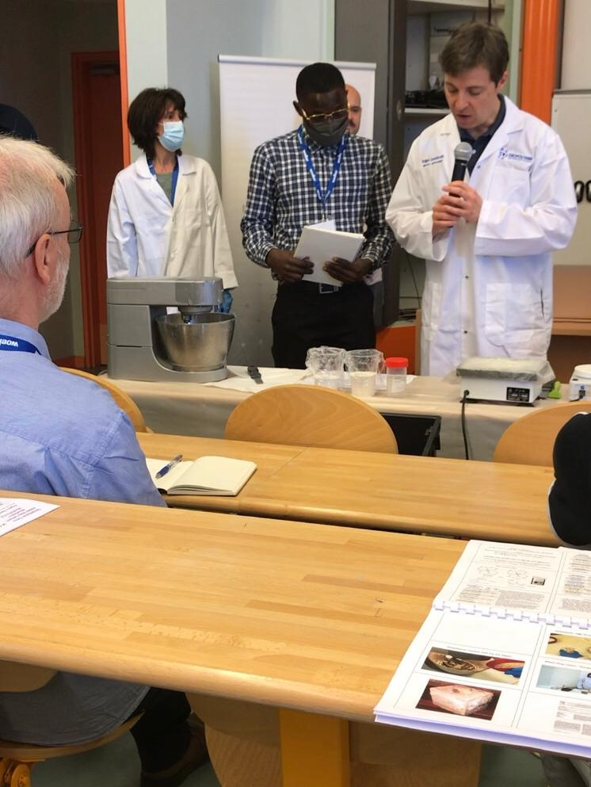

## About the Conference
The Geopolymer camp is a professional gathering established to learn, share, and network with people in the industry and academic environment around the globe. The annual conference is held at Saint-Quentin, North of Paris in France. The Geopolymer camp started in 2009, intending to learn chemistry and determine subsequent geopolymer applications. The publication of geopolymer-related studies increased over the years after the first Geopolymer camp. The camp includes a workshop tutorial and presentations of geopolymer-related applications. 
The workshop program comprises preparing geopolymer materials such as cement paste and ceramic. The workshop tutorial was a day program aimed to educate scientists, engineers, and researchers on the step-by-step preparation of geopolymer. A total of forty-nine participants from different countries around the world attended the workshop. The participants were further grouped into two (A and B) for better understanding. The step-by-step preparations of geopolymer cement mortar were carried out using different recipes. The two groups carried out three various geopolymer experiments. Each group performed two experiments with similar recipes. 

## Conference activities:
	Since 2010, professionals from different fields have presented their geopolymer application results during the camp. This year a total number of nine-six participants attended the program. However, three of the twenty-five speakers at the camp joined virtually due to some personal reasons. The presentations were scheduled for two days with four different sessions, including Geopolymer cement, industrial applications, 3D printing, conductive Geopolymer and Geopolymer archaeology. More than 50% of the presenters are from the industrial sector, which helps to understand the application of geopolymer in the field. In addition, most speakers presented geopolymer cement-related results in the field and laboratory. 
The geopolymer cement, concrete, and 3D printing sessions caught my attention due to their relevance to my studies. However, other presented results were used to have a diverse knowledge of geopolymer application. The application of geopolymer cement was used both in the field and laboratory-based on the presented results. In summary, silicate solution is a critical parameter that determines the strength of geopolymer cement. Curing at higher humidity and temperature improves the mechanical properties of geopolymer cement. The mixing procedure greatly influences the mechanical properties of geopolymer cement. In addition, incorporating fibre such as basalt and carbon nanomaterial improves the mechanical strength of geopolymer cement. Evaluation of aluminosilicate materials is essential for a better understanding of geopolymer chemistry. 

